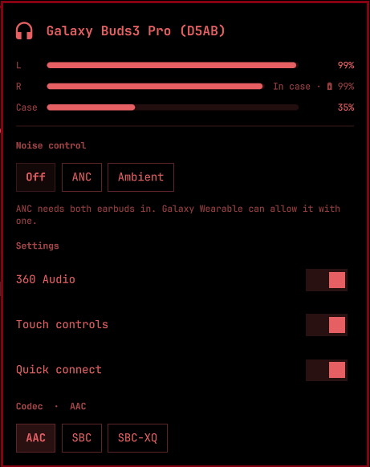

# Galaxy Buds Pro for Omarchy

[](https://github.com/akafrmn/omarchy-galaxy-buds-pro/actions/workflows/ci.yml)
[](LICENSE)
[](https://omarchy.org/manual/shell-plugins/)

Samsung **Galaxy Buds Pro, Buds2 Pro, Buds3 Pro and Buds4 Pro** in the Omarchy
bar: noise control, per-earbud and case battery, low battery warnings, the
Bluetooth codec, 360 Audio, touch controls and quick connect.



The icon follows the earbuds, not the other way around: change the mode by
touching an earbud or from your phone and the bar updates immediately.

- **Nothing to install.** Uses the system Python that Omarchy already ships. No
  daemon, no systemd unit, no setup script, no GUI app running in the
  background, no root.
- **Honest battery.** A bud in the case reads **In case**, a bud that dropped
  off the link reads **—**. It never draws a fake red 0%, and it never warns
  about a battery that is simply not being reported.
- **One notification, not one per monitor**, when a bud runs low.


## Compatibility

| Model | Model no. | Noise control | 360 Audio | Charging flags | Status |
|---|---|---|---|---|---|
| Galaxy Buds Pro (2021) | SM-R190 | off / ANC / ambient | firmware 2+ | — | protocol-derived |
| Galaxy Buds2 Pro | SM-R510 | off / ANC / ambient | yes | yes | tested upstream |
| Galaxy Buds3 Pro | SM-R630 | off / ANC / ambient | yes | yes | **verified on hardware** (firmware R630XXU0AZD2) |
| Galaxy Buds4 Pro | SM-R640 | off / ANC / ambient | yes | yes | protocol-derived, cross-checked with live captures |

"Protocol-derived" means the byte layout comes from the protocol and from other
open-source clients but no maintainer owns that pair yet. If you do, a
[compatibility report](https://github.com/akafrmn/omarchy-galaxy-buds-pro/issues/new?template=compatibility.yml)
takes two minutes and moves the row to verified.

The rest of the family keeps working too (Buds, Buds+, Buds Live, Buds2, Buds
FE, Buds Core, Buds3, Buds3 FE, Buds4). Controls a model does not have are
hidden rather than shown dead.

The model is detected from the Samsung device id the earbuds publish (so a
renamed pair is still recognised), and from the Bluetooth name on the 2021 Buds
Pro, which publishes no id and cannot be renamed.

## Requirements

- Omarchy 4 (the Quickshell-based `omarchy-shell`)
- A pair of Galaxy Buds. Not paired yet? Open the panel while disconnected,
  open the case, hold the touch sensors on both earbuds for about 7 seconds
  until the light starts flickering, then hit **Search**.
- `/usr/bin/python3` with `python-dbus` and `python-gobject`. Both come with a
  stock Omarchy install.
- PipeWire with `pactl`, for the codec row only. Everything else works without it.

## Install

Review the repository, then:

```bash
omarchy plugin add https://github.com/akafrmn/omarchy-galaxy-buds-pro.git --enable
```

The widget lands in the right section of the bar. Put it next to audio:

```bash
omarchy bar move io.github.akafrmn.galaxy-buds-pro --before omarchy.audio
```

Coming from `aislandener.galaxy-buds` or another Buds plugin? Remove it first.
Only one program can hold the earbuds' control link at a time (see
[How it works](#how-it-works)).

## Update

```bash
omarchy plugin update io.github.akafrmn.galaxy-buds-pro
```

Omarchy shows the diff, fast-forwards, and rolls back if the new version fails
validation.

## Remove

```bash
omarchy plugin remove io.github.akafrmn.galaxy-buds-pro
```

The plugin writes no files of its own, so nothing is left behind. The earbuds
keep whatever mode they were last set to.

## Keybinds

The plugin answers on its own IPC target, so a Hyprland bind can drive it
without opening the panel:

```
bind = SUPER SHIFT, A, exec, omarchy-shell io.github.akafrmn.galaxy-buds-pro cycle
bind = SUPER SHIFT, N, exec, omarchy-shell io.github.akafrmn.galaxy-buds-pro set anc
```

| Method | Does |
|---|---|
| `cycle` | Next noise mode the model supports |
| `set <off\|anc\|ambient>` | Set a noise mode |
| `codec <profile>` | Pin a PipeWire card profile |
| `status` | Print the current state as JSON |
| `open` / `close` / `toggle` | The panel |
| `testLowBattery` | Fire the low battery check now |

## Settings

Set these on the widget's entry in `~/.config/omarchy/shell.json`:

```json
{ "id": "io.github.akafrmn.galaxy-buds-pro",
  "lowBatteryWarning": true,
  "lowBatteryThreshold": 15,
  "labels": { "anc": "ANC", "inCase": "Im Etui" } }
```

| Key | Default | Meaning |
|---|---|---|
| `lowBatteryWarning` | `true` | Notify when either earbud reaches the threshold |
| `lowBatteryThreshold` | `15` | Percent, 1–50. Re-arms once the bud climbs 5% clear |
| `labels` | `{}` | Replace any visible string (see below) |

Earbuds that are charging, in the case or not connected are never counted
toward the warning.

### Labels

Every key is optional. Anything you leave out keeps its English text.

| Key | Default |
|---|---|
| `noiseControl` / `settings` / `codec` | Noise control / Settings / Codec |
| `off` / `anc` / `ambient` / `adaptive` | Off / ANC / Ambient / Adaptive |
| `spatial` / `touch` / `seamless` | 360 Audio / Touch controls / Quick connect |
| `left` / `right` / `case` / `inCase` | L / R / Case / In case |
| `ancOneBud` | ANC needs both earbuds in. Galaxy Wearable can allow it with one. |
| `notOutput` | Not the audio output |
| `disconnected` | Disconnected. Take them out of the case to reconnect. |
| `notPaired` | No Galaxy Buds paired. |
| `serviceOff` | The plugin service is not running. |

## Battery

Each earbud reports a placement: worn, out of the ear, in the case, or gone
from the link. A bud in the case, or one that has dropped off the link, sends a
battery of `0`, which means "no reading" and not "empty". The panel shows:

| Placement | Shows |
|---|---|
| worn / out of the ear | `64%`, red at 20% and below |
| in the case, reporting a charge | `In case · 󰂄 64%` |
| in the case, no reading | `In case` |
| in the closed case (sent just before the link drops) | `In case` |
| dropped off the link | `—` |

A charging bud counts as "in the case" even when its placement says otherwise.
Buds4 Pro reports a freshly docked bud as out of the ear for a moment. The case
only reports its own charge while at least one bud sits in it, so that row
comes and goes.

## Noise control with one earbud

With a single bud in, the firmware refuses ANC (it acks "Off") unless **Noise
controls with one earbud** is enabled in Galaxy Wearable. Ambient still works.
On Buds3, Buds3 Pro, Buds4 and Buds4 Pro the plugin reads that setting and
shows a hint under the mode buttons instead of a click that silently does
nothing. The panel always shows the mode the earbuds actually applied.

## Codec

The codec row comes from PipeWire, not from the earbuds, so it works the same
on every model. **Auto** is PipeWire's generic A2DP profile: it negotiates the
best codec both ends support, and the header shows what it picked
(`Codec · AAC`). The other buttons pin a specific codec. AAC needs
`libfdk-aac`.

While something holds the microphone, PipeWire switches the card to a headset
profile and the row offers the call codecs instead (LC3-SWB, mSBC, CVSD),
marked with a mic glyph. PipeWire switches back when the mic is released.

## Microphone troubleshooting

The plugin does not touch audio routing, but the Pro line's mic trips people up
on Linux. What it usually is:

- **In A2DP the mic "does not exist."** WirePlumber exposes a placeholder
  source (`bluez_input.XX:XX:…`, colons) that switches the card to the headset
  profile when an app opens it. The real headset nodes use underscores
  (`bluez_input.XX_XX_….0`). This is by design, not missing hardware.
- **Expect about 1–1.5 s of silence** at the start of a recording that triggers
  the switch. You may also see a transient `Failure in Bluetooth audio transport`
  in the journal. It is normal as long as the node recovers.
- **The default source fell back to the laptop mic**, or the card got stuck on
  `headset-head-unit-cvsd` (8 kHz). Check
  `~/.local/state/wireplumber/{default-nodes,default-profile,bluetooth-autoswitch}`,
  fix the entry, then restart WirePlumber (logging out and back in works too).
  Buds2 Pro and later should land on `headset-head-unit` (LC3-SWB or mSBC).
- **Quiet ambient recordings are fine.** The earbuds gate noise hard. Test by
  speaking.
- **In-call audio barely audible?** The headset-profile route keeps its own
  volume. Raise it once while on a call.

## What it does on your system

- **Bluetooth**: registers an `org.bluez.Profile1` client on the system D-Bus
  and opens one RFCOMM socket to the earbuds. It talks to no other device.
- **Commands**: `/usr/bin/python3` (its own helper), `pactl` (list cards and
  sinks, set a card profile when you pick a codec), `omarchy-bluetooth-device`
  (only when you pair from the panel), and `omarchy-notification-send` (low
  battery).
- **Privileges**: your own user. It never elevates.
- **Files**: none written. Nothing is read outside its own folder.
- **Network**: none.
- **Background**: one helper process, started and stopped with the shell.
- **IPC**: the `io.github.akafrmn.galaxy-buds-pro` shell target. The plugin adds
  no keybindings of its own.

## Security

Omarchy plugins run unsandboxed inside `omarchy-shell`. Review the source and
the list above before installing. Report vulnerabilities privately as described
in [SECURITY.md](SECURITY.md).

## How it works

`bin/galaxy-buds` speaks Samsung's SPP protocol over an RFCOMM socket that
BlueZ hands over through the Profile1 API, the same path GalaxyBudsClient takes
on Linux. It prints the earbud state as JSON lines and reads commands as JSON
lines on stdin.

`Service.qml` runs that helper once per session. Bar widgets are mounted once
per monitor, so each monitor's widget reads from the one service rather than
starting its own helper.

**Only one program can hold that link.** GalaxyBudsClient, another Buds plugin,
or a second copy of the helper will take it away from this one. Drive the
plugin through its IPC target instead.

What differs per model lives in the `PROFILES` table in `bin/galaxy-buds`: the
service UUID, the noise command, where each field sits in the status message,
and which firmware revision started reporting it. Adding a model is a row and a
test. See [CONTRIBUTING.md](CONTRIBUTING.md).

## FAQ

**Is it on the AUR?** No, on purpose. Omarchy loads third-party plugins only
from `~/.config/omarchy/plugins`, AUR packages must not write into home
directories, and the plugin validator rejects symlinks. A package could only
ship a "copy me in" script, which would then fight `omarchy plugin update`.
`omarchy plugin add` is the supported distribution channel.

**Equalizer?** Not yet. Buds4 Pro acks EQ presets (message `0x86`, seen in
hmarquez-solutions/omarchy-buds), but no preset UI ships here until it is
confirmed on each Pro model. `tools/eq-probe.py` asks your pair directly. Post
what it prints in an issue.

## Development

Clone the repository, then from its folder:

```bash
make check        # tests, manifest and QML checks, lint
```

The dev loop, the protocol notes and how to add a model are in
[CONTRIBUTING.md](CONTRIBUTING.md).

## Credits

Inspired by and based on the work of **Aislan Dener Souza Vicentini** and
[aislandener/galaxy-buds-control](https://github.com/aislandener/galaxy-buds-control).
The protocol engine, framing, model table and panel are his. This repository
keeps his full commit history. See [CONTRIBUTORS.md](CONTRIBUTORS.md) for
everyone involved.

Protocol knowledge comes from
[GalaxyBudsClient](https://github.com/timschneeb/GalaxyBudsClient) by Tim
Schneeberger (read for reference, no code copied) and from the Buds4 Pro
captures in
[hmarquez-solutions/omarchy-buds](https://github.com/hmarquez-solutions/omarchy-buds).

Not affiliated with or endorsed by Samsung. "Galaxy Buds" is a trademark of
Samsung Electronics.

## License

[MIT](LICENSE). Copyright Aislan Dener Souza Vicentini and Oleksii Lysenko.
